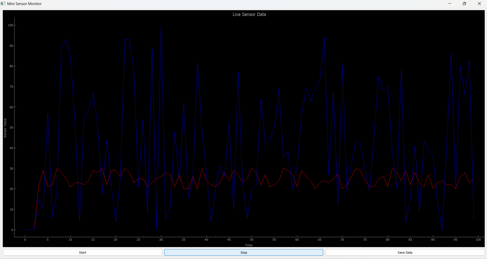

# 🧪 Mini Sensor Monitor (PyQt5 + PyQtGraph)

A lightweight real-time GUI application for simulating and visualizing sensor data using Python, PyQt5, and PyQtGraph.

## 🖼️ Preview



## 🎯 Features

- Live plotting of simulated sensor data:
  - 🌡️ Temperature (red)
  - 🧭 Acceleration (blue)
- GUI built with PyQt5
- Real-time plotting using PyQtGraph
- Start/Stop data stream
- Save data as CSV file with timestamp
- Clean layout using QVBox/QHBox

## 🛠️ Requirements

- Python 3.9+
- PyQt5
- PyQtGraph

## 📦 Installation

```bash
# Create and activate virtual environment (optional)
python -m venv venv
venv\Scripts\activate  # On Windows

# Install dependencies
pip install pyqt5 pyqtgraph
````

## 🚀 Run the App

```bash
python main.py
```

## 📁 Output

After clicking “Save Data”, a `.csv` file like this will be created:

```
Index,Temperature,Acceleration
0,24,75
1,23,82
2,25,77
...
```

## 💡 Motivation

This project was built as a quick proof-of-concept for a Qt-based GUI to accompany an application for an Embedded Systems R&D role at SensThings. The goal was to demonstrate:

* ✅ Initiative in learning Qt/Py (PyQt5)
* ✅ Experience with sensor data simulation and visualization
* ✅ Readiness to develop control interfaces for embedded/IoT platforms

---

Made with ❤️ by Wissal Biyadi

```
